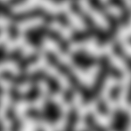
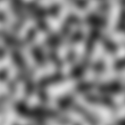
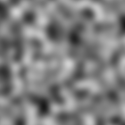

################################################################################
OpenSimplex Noise
################################################################################
|build-status| |coverage-status|

    OpenSimplex noise is an n-dimensional gradient noise function that was
    developed in order to overcome the patent-related issues surrounding
    Simplex noise, while continuing to also avoid the visually-significant
    directional artifacts characteristic of Perlin noise.

This is merely a python port of Kurt Spencer's original code, released to the
public domain, and neatly wrapped up in a package.

USAGE
================================================================================
Initialization:
--------------------------------------------------------------------------------

>>> from opensimplex import OpenSimplex
>>> tmp = OpenSimplex()
>>> print (tmp.noise2d(x=10, y=10))
0.732051569572

Optionally, the class accepts a seed value:

>>> tmp = OpenSimplex(seed=1)
>>> print (tmp.noise2d(x=10, y=10))
-0.4790979022623557

The seed must be a valid python number. It's used internally to generate some
permutation arrays, which is used for the noise generation.

If it isn't provided the class will **default to use 0 as the seed**.

Available class methods:
--------------------------------------------------------------------------------

OpenSimplex.noise2d(x, y)
    Generate 2D OpenSimplex noise from X,Y coordinates.

OpenSimplex.noise3d(x, y, z)
    Generate 3D OpenSimplex noise from X,Y,Z coordinates.

OpenSimplex.noise4d(x, y, z, w)
    Generate 4D OpenSimplex noise from X,Y,Z,W coordinates.

Running tests and benchmarks:
--------------------------------------------------------------------------------

First make a virtualenv and install the dev. requirements:

    virtualenv venv
    source venv/bin/activate
    pip install -r requirements.txt

and then simply run the tests:

    make test

or the basic benchmark:
    make benchmark

FAQ
================================================================================
- Is this relevantly different enough to avoid any real trouble with the original patent?

    If you read the `patent claims`_:

    Claim #1 talks about the hardware-implementation-optimized gradient generator. Most software implementations of Simplex Noise don't use this anyway, and OpenSimplex Noise certainly doesn't.

    Claim #2(&3&4) talk about using (x',y',z')=(x+s,y+s,z+s) where s=(x+y+z)/3 to transform the input (render space) coordinate onto a simplical grid, with the intention to make all of the "scissor-simplices" approximately regular. OpenSimplex Noise (in 3D) uses s=-(x+y+z)/6 to transform the input point to a point on the Simplectic honeycomb lattice so that the simplices bounding the (hyper)cubes at (0,0,..,0) and (1,1,...,1) work out to be regular. It then mathematically works out that s=(x+y+z)/3 is needed for the inverse transform, but that's performing a different (and opposite) function.

    Claim #5(&6) are specific to the scissor-simplex lattice. Simplex Noise divides the (squashed) n-dimensional (hyper)cube into n! simplices based on ordered edge traversals, whereas OpenSimplex Noise divides the (stretched) n-dimensional (hyper)cube into n polytopes (simplices, rectified simplices, birectified simplices, etc.) based on the separation (hyper)planes at integer values of (x'+y'+z'+...).

    Another interesting point is that, if you read all of the claims, none of them appear to apply to the 2D analogue of Simplex noise so long as it uses a gradient generator separate from the one described in claim #1. The skew function in Claim #2 only applies to 3D, and #5 explicitly refers to n>=3.

    And none of the patent claims speak about using surflets / "spherically symmetric kernels" to generate the "images with texture that do not have visible grid artifacts," which is probably the biggest similarity between the two algorithms.

    - **Kurt**, on Reddit_.

CREDITS
================================================================================
- Kurt Spencer - Original work
- A Svensson - Python port and package author
- CreamyCookie - Cleanup and optimizations

LICENSE
================================================================================
While the original work was released to the public domain by Kurt, this package
is using the MIT license. Please see the file LICENSE for details.

Expected Output
================================================================================
2D noise (with default seed):

3D noise:

4D noise:

.. _Reddit: https://www.reddit.com/r/proceduralgeneration/comments/2gu3e7/like_perlins_simplex_noise_but_dont_like_the/ckmqz2y
.. _`patent claims`: http://www.google.com/patents/US6867776
.. |build-status| image:: https://travis-ci.org/lmas/opensimplex.svg?branch=master
   :target: https://travis-ci.org/lmas/opensimplex
.. |coverage-status| image:: https://coveralls.io/repos/github/lmas/opensimplex/badge.svg?branch=master 
   :target: https://coveralls.io/github/lmas/opensimplex?branch=master
